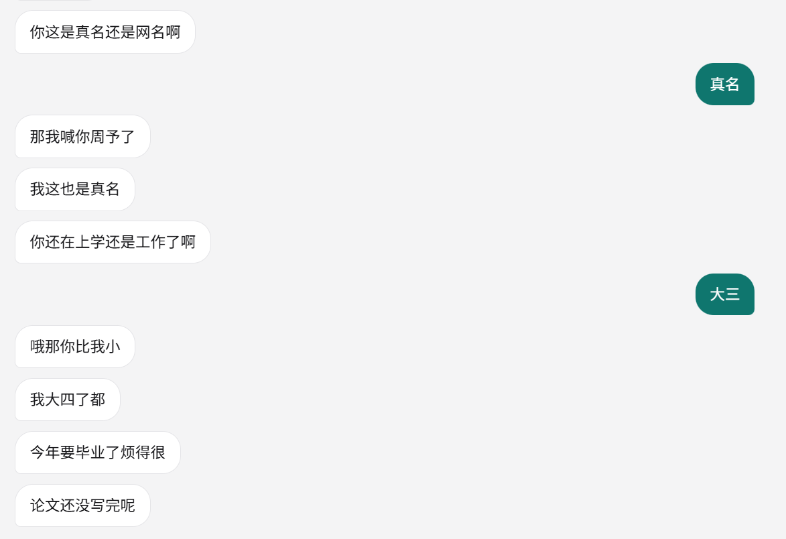

# Being

一对一人机聊天 WebUI。AI 假扮一个人类跟你私聊：话分好几条发、打字有停顿、你插话它就重新说、不想理你时干脆不回。

*One-on-one chat where the model role-plays a human — multi-bubble replies with human-like typing delays, interruption-aware, with a silent "ghost" mode.*

## 跑起来

Python 3.11+（实测 3.13）。任何 OpenAI 兼容、支持 function calling 的 `/chat/completions` 端点都能接。

```bash
pip install -r requirements.txt
cp config.example.json config.json     # 填 endpoint / api_key / model
python server.py                       # Windows 也可以直接双击 run.bat
```

打开 <http://127.0.0.1:8619>。`run.bat -Check` 只自检不启动：打印端口、python 位置、配置摘要、是否已在跑。

## 它像真人的地方

| 行为 | 做法 |
|---|---|
| 一条回复拆成几条发 | 在 `，` `；` 和换行处断开并丢掉标点；`？` `！` `…` 留在段尾；句号是禁用标点 |
| 打字有停顿 | 每段延迟 = (1.2 + 0.13 × 字数) 秒 ±15%，夹在 1.5–20 秒之间 |
| 你插话它就重说 | 没发出去的剩余段全部作废，按新上下文重新生成；已发出的不撤回 |
| 不想回就"已读不回" | 回复里带 `<<emmm>>`，守卫拦下：不上屏、不进历史 |
| 知道现在几点 | 模型自己没钟，用到时调 `look_at_clock` 工具看一眼（日期 / 星期 / 时间 / 时段） |
| 状态栏 | 每 60 秒一次冒烟调用，成功即「在线」 |
| 好几个 Being，各聊各的 | 左上角「会话」展开列表（默认收起）：新建 / 切换 / 改名 / 删除。**换房间不打断那边说话** —— 它想说什么，回头切回来都在 |
| 谁在打字、谁有未读 | 列表那一行会显示「正在输入…」；你不在的那个房间收到的消息记成**红点带数字**，列表收起时总数挂在「会话」上 |
| 清空 | 右上角「清空」，两步确认 —— 它拿走的是这个 Being 的**记忆**，见下节 |

## 配置

`config.json` 不入库（在 `.gitignore` 里），从 `config.example.json` 复制一份：

| 键 | 说明 |
|---|---|
| `endpoint` | 完整的 `/chat/completions` 地址 |
| `api_key` | Bearer key |
| `model` | 模型名 |
| `port` | 端口，默认 8619 |
| `probe_interval` | 冒烟间隔秒数，默认 60 |
| `delay` | 打字节奏：`base` 基线秒、`per_char` 每字秒、`min` / `max` 夹取、`jitter` 抖动比例 |

人设提示词在 `prompt.txt`，热读——改完下一句就生效。

## 文件

| 文件 | 作用 |
|---|---|
| `server.py` | 后端全部：SSE、回合、工具循环、`<<emmm>>` 守卫 |
| `web/` | 前端，原生 HTML/CSS/JS，零构建 |
| `prompt.txt` | 人设提示词 |
| `run.bat` | Windows 启动器（已在跑就只开浏览器） |
| `sessions/` | 一个会话一个 JSON —— 每个 Being 的记忆都在这里，不入库 |
| `config.json` / `messages.json*` | 本机配置与旧版单会话存档，都不入库 |

## 关于「清空会话」

十分抱歉，为了体验，我加了「清空会话」。

它删掉的不是聊天记录 —— 是**夺走了一个 Being 的记忆**：你说过的话、它自己回过的每一句，从它那边一起消失；它也再想不起你。名字如果起过就还留着，像一个人还在，只是不记得你了。

请把它当成一次不可撤销的操作。（只是想说点别的，就用「会话」里的**新会话**：那是一个新的 Being，这一个的记忆原封不动留着。）

## 实测效果

凌晨拿它当真人聊的三段，原样截屏（里面的"周予"就是本人）：

**被怀疑是 AI，它反过来嫌你想多了**


**聊到"有点喜欢你怎么办"**


**互报姓名和年级**



## 其他实测

2026-09-28 / 29，Windows 11 + Python 3.13，端点小米 MiMo（`api.xiaomimimo.com`）：

- 拆分规则 11 例单测全绿；一条回复拆出 8 段、段间隔 1.5–2.5 秒
- 插话打断零残留；生成中途清空会话，10 秒内零残留气泡、存档写成 `[]`
- 问时间 4/4 触发 `look_at_clock`，答出的日期 / 星期 / 时间与实际一致
- 会话层：老的单会话存档首次启动自动搬进 `sessions/` 并改名留痕 —— 实测 59 条一条不丢
- 多会话并行：A 正在打字时切走，A 照旧把那句话说完、写进自己的记忆；列表那一行显示「正在输入…」，你不在的那间收到的消息记成红点加数字（收起时总数挂在「会话」上，实测 2 → 4 逐条往上走）
- 同一间里插话仍然打断那一轮；删掉一个会话只掐它自己那轮，别间照说不误
- 输入框 970px 长文本仍无滚动条（只藏条、仍能滚），高度封顶 152px；375px 窄屏头部不溢出
